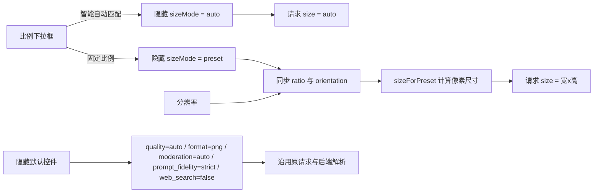

# GPT 输出设置精简设计

**日期：** 2026-07-26  
**状态：** 已确认交互方向，待实施  
**适用范围：** GPT Image 2 旧版输出设置区域

## 1. 目标

减少 GPT 模型页面中低频输出参数的占用，只保留用户生成图片时最常调整的三个控件：

1. 比例
2. 分辨率
3. 数量

被隐藏的控件和服务端参数不能删除。现有 API、历史任务、任务摘要、请求解析和供应商适配层仍需继续识别这些参数。

## 2. 取消旧方案

取消 `2026-07-26-gpt-output-settings-compact-layout.md` 对应的紧凑矩阵改造，包括：

- `compactOutputSettings` 统一矩阵容器；
- 质量、数量等字段的矩阵定位类；
- Auto、Preset、Custom 三态网格跨度；
- 对应的静态 DOM 和 CSS 契约测试。

保留此前已经完成的真实 `size="auto"` 功能和服务端画布参数支持。

## 3. 页面可见结构

GPT Image 2 输出设置区域默认只显示：

| 控件 | 默认值 | 行为 |
|---|---|---|
| 比例 | 智能自动匹配 | 统一负责 Auto 和固定比例选择 |
| 分辨率 | 1K | 保持原有 1K、2K、4K 选项 |
| 数量 | 1 | 保持原有 1、2、3、4 选项 |
| 输出像素状态 | `auto` 或计算后的像素值 | 只读反馈，不提供额外设置 |

页面不再显示独立的“尺寸模式”“方向”“自定义尺寸”控件。

## 4. 统一比例下拉框

复用现有比例参数和尺寸计算能力，不建立第二套尺寸算法。

下拉框选项：

| 值 | 显示文本 | 内部行为 |
|---|---|---|
| `auto` | 智能自动匹配 | `sizeMode=auto`，提交 `size=auto` |
| `1:1` | 1:1 方形/头像/商品 | `sizeMode=preset`，按当前分辨率计算尺寸 |
| `4:5` | 4:5 小红书/海报 | 同上 |
| `5:4` | 5:4 横版商品 | 同上 |
| `3:4` | 3:4 竖版作品 | 同上 |
| `4:3` | 4:3 配图/插画 | 同上 |
| `2:3` | 2:3 人物海报 | 同上 |
| `3:2` | 3:2 横版摄影 | 同上 |
| `9:16` | 9:16 竖屏/短视频 | 同上 |
| `16:9` | 16:9 封面/视频 | 同上 |
| `9:21` | 9:21 超长竖图 | 同上 |
| `21:9` | 21:9 超宽横图 | 同上 |

行为规则：

- 初次打开页面默认选择“智能自动匹配”。
- 选择固定比例时，内部自动切换为 Preset，并根据比例同步隐藏的方向值。
- 固定比例下修改分辨率时，继续使用原有 `sizeForPreset()` 计算实际尺寸。
- Auto 下修改分辨率只保存分辨率选择，不得把 `size=auto` 改成固定尺寸；用户之后选择固定比例时再应用该分辨率。
- 自定义宽高不出现在下拉框中，也不显示宽高输入框。
- 自定义尺寸的服务端解析、校验和供应商适配代码保留，API 调用方仍可提交自定义尺寸。
- 旧历史任务中的自定义尺寸仍由历史数据和隐藏内部字段解析；当前页面不提供新建或编辑自定义宽高的入口。

## 5. 永久隐藏的 GPT 页面控件

| 前端控件 | Web 页面默认值 | 服务端默认值 | 处理方式 |
|---|---|---|---|
| 输出格式 | `png` | `png` | 隐藏控件与压缩率入口，参数保留 |
| 审核 | `auto` | `auto` | 隐藏控件，路由默认值改为 `auto` |
| 质量 | `auto` | `auto` | 隐藏控件，路由默认值由 `low` 改为 `auto` |
| API 直连提示和设置入口 | 不适用 | 不改变 | 隐藏提示块，不删除 API 渠道与绑定能力 |
| 联网搜索 | `false` | `false` | 隐藏控件，参数保留 |
| 提示词处理 | `strict` | `strict` | 隐藏控件，参数保留 |
| 方向 | 由比例同步 | 不改变 | 隐藏控件，固定比例选择时继续更新 |
| 自定义尺寸 | 无入口 | 不改变 | 隐藏控件，后端能力保留 |

隐藏必须作用于字段容器，而不是删除 `<select>`、`<input>` 或元素 ID。这样可以继续复用以下现有逻辑：

- 表单提交；
- 模型参数草稿；
- 历史任务恢复；
- 请求预览；
- 任务摘要；
- 旧供应商适配；
- API 直接调用。

## 6. 参数流

## 7. 兼容策略

1. 不删除旧字段 ID，避免事件绑定、历史恢复和测试辅助代码失效。
2. 不删除服务端表单参数，不缩减模型清单允许值。
3. 服务端继续允许 API 调用方显式传入 `quality`、`moderation`、`output_format`、`prompt_fidelity`、`web_search` 和自定义 `size`。
4. 只有参数缺失时才使用新的服务端默认值；显式参数优先。
5. 不发起真实图片生成请求，避免产生费用。

## 8. 测试要求

### 静态结构

- 页面只存在一个用户可见的比例选择器。
- 比例选择器默认值为 `auto`，并包含全部固定比例。
- 分辨率和数量保持可见。
- 输出格式、审核、质量、API 直连提示、联网搜索、提示词处理、方向和自定义尺寸字段均被永久隐藏。
- 隐藏字段的元素 ID 和选项仍存在。

### 前端行为

- Auto 提交 `size=auto`。
- 固定比例按当前分辨率生成原有像素尺寸。
- 在 Auto 下修改分辨率不会改变 `size=auto`。
- 数量仍提交选定值。
- 默认请求仍包含 `quality=auto`、`output_format=png`、`moderation=auto`、`prompt_fidelity=strict`、`web_search=false`。
- 历史恢复和参数采用不会因为隐藏字段缺失而报错。

### 后端

- `/api/generate` 和 `/api/edit` 缺省质量为 `auto`。
- `/api/generate` 和 `/api/edit` 缺省审核为 `auto`。
- 输出格式、提示词处理和联网搜索保持现有默认值。
- 显式传入非默认值时仍按传入值执行，证明参数能力没有被删除。

## 9. 验收标准

- GPT 输出设置区域明显缩短，只显示比例、分辨率、数量和像素反馈。
- 初次打开页面为“智能自动匹配”，实际请求为 `size=auto`。
- 固定比例仍能得到和改造前一致的尺寸参数。
- 所有隐藏参数在前后端继续存在，API 兼容性不变。
- 前端构建、类型检查和相关 Python/Node 测试全部通过。
- 本地、GitHub 和服务器最终使用同一个提交。
